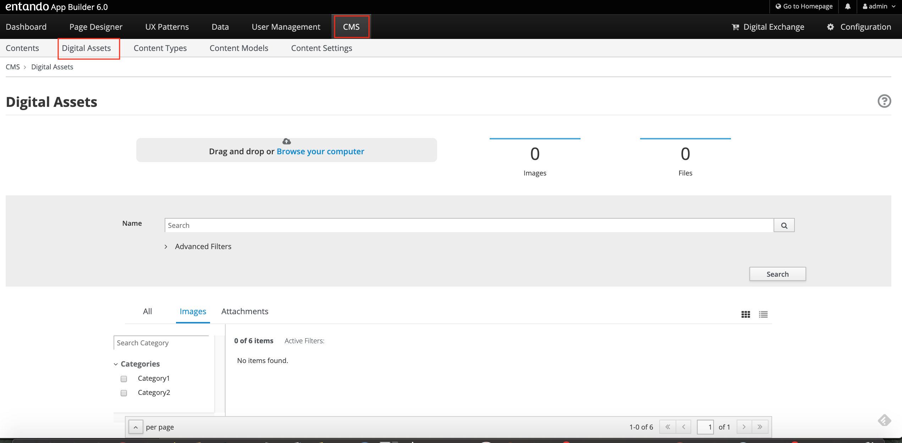
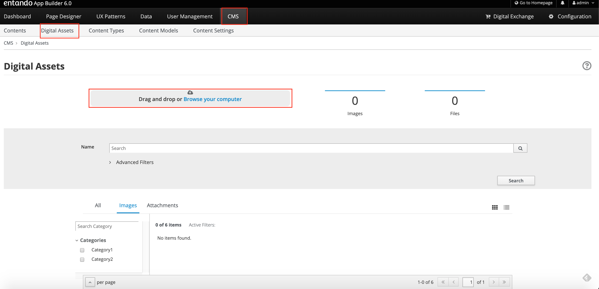
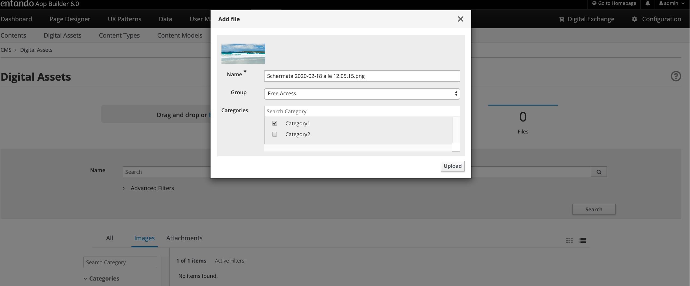
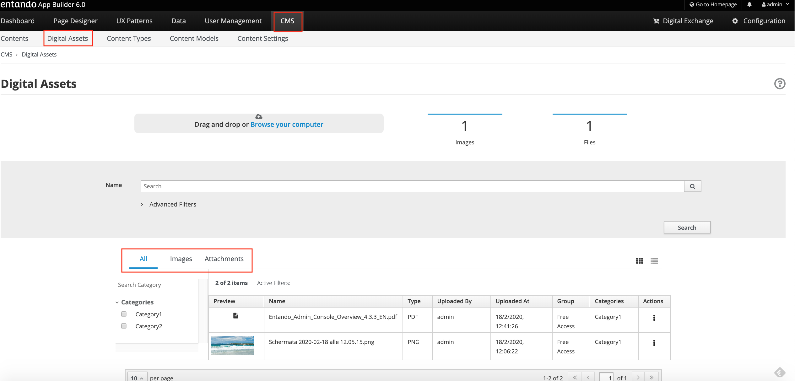

# Digital Assets

## Objective

This document provides an overview of the Digital Assets and
functionalities needed to manage images and documents.

## Overview

The WEB CMS includes capabilities that let you manage contents and
digital assets. Digital Assets are images, documents, and other media
files supported in specific format.

**Default Supported document formats:** The Entando CMS can be
configured to allow you to load or exclude any type of file extension
from being loaded to your site. The default set of extensions are:

pdf,xls,doc,ppt,txt,rtf,sxw,sxc,odt,ods,odp,tar,gz,zip,rar,flv,swf,avi,wmv,ogg,mp3,wav,ogm,mov,iso,nrg,docx,docm,xlsx,xlsm,xlsb,pptx,pptm,ppsx,ppsm,sldx,sldm.

**Supported image formats**: jpg, jpeg, png

## How to create a Digital Asset

To manage the Digital Assets through the Web CMS integrated with App
Builder application

-   Select the CMS section and click on the Digital Assets subsection

Add a new image or a new document file

-   Press the **Drag and Drop or Browse your computer** button and
    choose, from your file system, images and documents files that you
    would like to upload

-   From the **Add file** modal window, you must choose one the
    available Groups and then the **Upload** button. If categories have
    been defined and displayed , you can join the file with the
    categories you want.

-   The image file that you just uploaded is displayed in the list; a
    statistical overview of the number of the uploaded resources (images
    and documents) is provided. The App Builder’s interface allows the
    users to choose grid and list view; most of the time, users prefer
    to use list view when they are searching with specific requirements,
    while they love grid view for exploring. For every resource, image,
    or document, the list shows the following information:

    -   **Preview**

    -   **Name**

    -   **Type**

    -   **Uploaded By**

    -   **Uploaded At**

    -   **Group**

    -   **Categories**

    -   **Actions**

Furthermore, the interface lets you perform all management actions, as:

-   **Edit:** update the information data related to every single
    resource (image and document)

-   **Duplicate:** copy identically the resource from the original

-   **Download:** transfer the resource in your local machine

-   **Delete:** remove the resource

You can list the contents by filtering with:

-   **All**: All added files are displayed, images and documents both.

-   **Images**: All added images are displayed

-   **Attachments**[1]: All added documents are displayed

[1] The Attachments name will be updated to the Documents name; the same
for the Files label.

