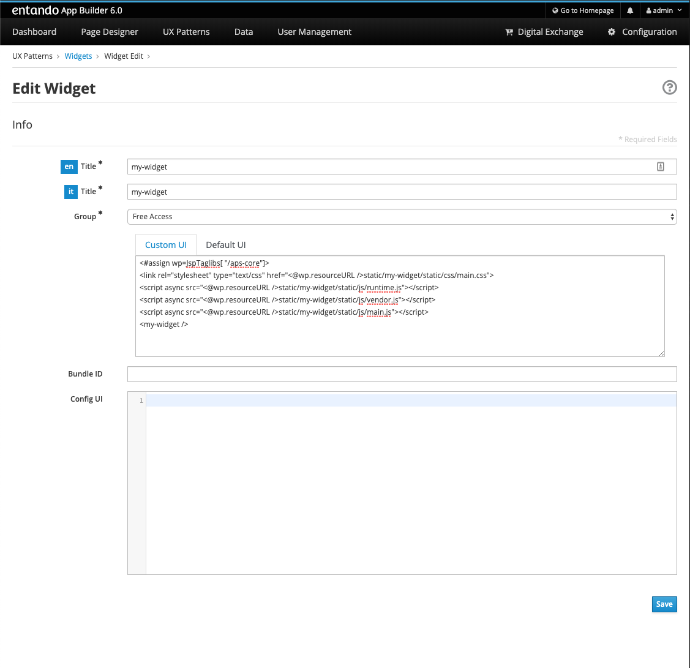

# Tutorial: Add App Builder configuration screen for an Entando 6 widget

Entando 6 widgets can be customized through an App Builder configuration
screen so the citizen developers can avoid writing ad-hoc additional
code.

In Entando 6, the configuration screen is also a micro frontend, which
can also be defined as a web component. That means you can develop and
test it in isolation, without a running Entando instance.

## Generate a React app

Let’s start with the boilerplate provided by [Create React
App](https://create-react-app.dev/), probably the most popular one.

`npx create-react-app my-widget-config --use-npm`

    my-widget-config
    ├── README.md
    ├── node_modules
    ├── package.json
    ├── .gitignore
    ├── public
    │   ├── favicon.ico
    │   ├── index.html
    │   ├── logo192.png
    │   ├── logo512.png
    │   ├── manifest.json
    │   └── robots.txt
    └── src
        ├── App.css
        ├── App.js
        ├── App.test.js
        ├── index.css
        ├── index.js
        ├── logo.svg
        ├── serviceWorker.js
        └── setupTests.js

Then, type `cd my-widget-config` and `npm start` to start the app.

## Edit the root app component

Let’s start with a simple form: only an input with a label. So, let’s
edit `App.js`

    import React from 'react';

    class App extends React.Component {
      constructor(props) {
        super(props);
        this.state = { name: ''};
      }

      handleNameChange(value) {
        this.setState(prevState => ({
          ...prevState,
          name: value,
        }));
      }

      render() {
        const { name } = this.state;
        return (
          

            <h1>Sample Entando 6 Widget Configuration</h1>
            <label htmlFor="name">Name</label>
            <input id="name" onChange={e => this.handleNameChange(e.target.value)} value={name} />
          

        );
      }
    }

    export default App;

You are free to use your favorite form handling library e.g.,
[Formik](https://jaredpalmer.com/formik),
[redux-form](https://redux-form.com/) (that requirese redux) or others.

In regards to styling, since this is going to be an App Builder screen,
we strongly suggest using [PatternFly
v3](https://www.patternfly.org/v3/) (`patternfly` and `patternfly-react`
packages) to keep UX coherence.

## Wrap the react app in a web component

Now, let’s add the web component that will wrap the entire React app.
Let’s name it `WidgetElement`

    import React from 'react';
    import ReactDOM from 'react-dom';
    import App from './App';

    class WidgetElement extends HTMLElement {
      constructor() {
        super();
        this.reactRootRef = React.createRef();
        this.mountPoint = null;
      }

      get config() {
        return this.reactRootRef.current ? this.reactRootRef.current.state : {};
      }

      set config(value) {
        return this.reactRootRef.current.setState(value);
      }

      connectedCallback() {
        this.mountPoint = document.createElement('div');
        this.appendChild(this.mountPoint);
        ReactDOM.render(<App ref={this.reactRootRef} />, this.mountPoint);
      }
    }

    customElements.define('my-widget-config', WidgetElement);

    export default WidgetElement;

Its responsibility is rendering the react app and syncing the react app
state in a `config` property, that *must* be named that way. The key to
App builder communication is that it works in three steps:

-   App Builder reads `config` property when the widget config screen is
    rendered

-   `config` property is mutated when a user configures the widget

-   When a user saves the config, App Builder retrieves it (again, from
    the `config` property) and persists it through Entando APIs

This means the widget developer can focus on the configuration screens
without having to call Entando APIs to read or write configuration.

One more JS file to update: `index.js`. Starting from this

    import React from 'react';
    import ReactDOM from 'react-dom';
    import './index.css';
    import App from './App';
    import * as serviceWorker from './serviceWorker';

    ReactDOM.render(<App />, document.getElementById('root'));

    // If you want your app to work offline and load faster, you can change
    // unregister() to register() below. Note this comes with some pitfalls.
    // Learn more about service workers: https://bit.ly/CRA-PWA
    serviceWorker.unregister();

You only have to import `WidgetElement` plus the css, if needed.
Something like

    import './index.css';
    import './WidgetElement';

We assume we don’t need a service worker for the widget, so we can
delete serviceWorker.js.

To ensure our web component is working we have to edit
`public/index.html`. Remove `

` from the `body` (we
programmatically generated the react root in the `connectedCallback`
method of `WidgetElement`) and add our new web component tag
`<my-widget />`.

    <!DOCTYPE html>
    <html lang="en">
      <head>
        <meta charset="utf-8" />
        <link rel="shortcut icon" href="%PUBLIC_URL%/favicon.ico" />
        <meta name="viewport" content="width=device-width, initial-scale=1" />
        <title>React App</title>
      </head>
      <body>
        <my-widget-config />
      </body>
    </html>

> **Note**
>
> the web component tag name (`my-widget-config` in this tutorial)
> *must* match the first parameter of the `customElements.define`
> method.

The page should auto reload and…​congrats, you’re running an Entando 6
widget in isolation.

## Add widget config screen in App Builder

Before integrating the widget config screen, we need some widget info.
Open App Builder, go to UX Patterns → Widgets and click on the installed
widget that we’re creating the configuration screen for.

You’ll see a screen like:

Next, we’ll build our widget before embedding it into the Entando 6
instance. From the react project root, type

`npm run build`

and a `build/static` directory will be generated. Copy it into the
Entando 6 instance under
`src\main\webapp\cmsresources\my-widget-config`, then rename

-   a file like `js/runtime~main.c7dcdf0b.js` to `js/runtime.js`
    (bootstrapping logic)

-   a file like `js/2.230b21ef.chunk.js` to `js/vendor.js` (third-party
    libraries)

-   a file like `js/main.1fd3965a.chunk.js` to `js/main.js` (app)

Now, edit again the widget and update the `configUI` field.

    {
      "customElement": "my-widget-config",
      "resources": [
        "my-widget-config/static/js/runtime.js",
        "my-widget-config/static/js/vendor.js",
        "my-widget-config/static/js/main.js"
      ]
    }

> **Note**
>
> -   It is possible to keep the original names in order to avoid
>     potential caching issues, but then you will have to update the
>     *Config UI* field in the App Builder widget screen each time a new
>     version of the widget is deployed.
>
> -   `configUI` is a JSON object, so pay attention to save a
>     well-formed one (the integrated JSON editor will help you)
>
> -   value for `customElement` must match the name of custom tag in
>     `index.html` and the one passed as parameter to
>     `customElements.define` in `WidgetElement`
>
Last step: configure a page in App Builder, drag our widget into the
page model slot and you’ll see the configuration screen we just built.

