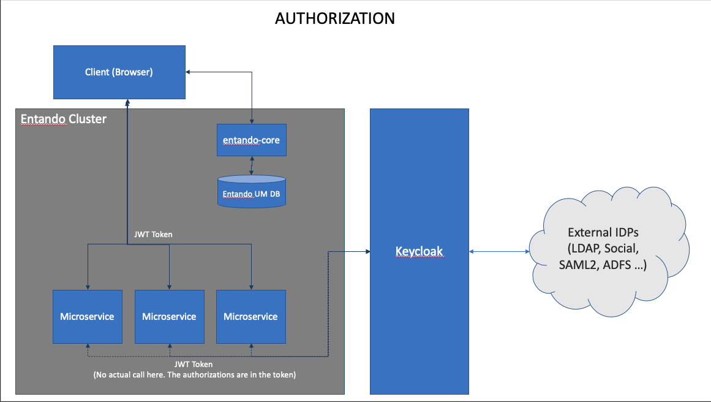

# Entando Identity Management -- Keycloak

Entando Identity Management is powered by Keycloak. The Keycloak instance used for your Entando apps
can be [externally installed](../../tutorials/devops/external-keycloak) or you can use a dedicated instance on a per application basis. The sections below details the architecture and documentation required to customize your Keycloak instance.

## Logging into your Keycloak Instance

In an Entando deployment Keycloak is protected by a Secret deployed in your Kubernetes instance. To get the default admin credentials you can query Kubernetes for the secret with this command:

```
kubectl get secret <project-name>kc-admin-secret -n <namespace> -o go-template="{{println}}Username: {{.data.username | base64decode}}{{println}}Password: {{.data.password | base64decode}}{{println}}{{println}}"
```

Replace `<project-name>` and `<namespace>` with your values. If you're not sure of the secret name you can run
```
kubectl get secrets -n <namespace>
```
And search for the secret that ends in `kc-admin-secret`

## Authentication
In Entando 6 all authentication goes through Keycloak. This ensures that a micro frontend can call a microservice with a token that is available on the client.



By using Keycloak as a central point of authentication the Entando architecture is able to provide a single unified view of identity to the entire architecture. With this architecture Entando becomes more portable and can be integrated into other IDPs without changes to the source. Keycloak acts as an  abstraction to the underlying IDP.

## Authorization

### Plugins/Microservices
Authorization for the microservices comes from clients and roles in keycloak. The authorizations are stored in the JWT token and are available to the services when invoked.

### Core
Authorization for the entando-core and WCMS is provided by the Entando user management database. When a user is authenticated to the entando-core  a copy of that user is added to the Entando user management database.  That copy is made in support of the authorization flow noted below.

As noted above when a user is authenticated to the entando-core via keycloak a copy of that user is added to the entando-core user management database in support of WCMS functionality.  Using the App Builder WCMS roles and groups can be assigned to a user for access to functions in the App Builder or for portal-ui based content access in the runtime application The code that copies the user into the entando-core can be customized to automatically create groups and roles as needed for an application but it is something that must be done on a per implementation basis.

For more details on the code that copies users and data to the WCMS database see the [entando-keycloak-plugin](https://github.com/entando/entando-keycloak-plugin). The readme in that project includes properties that are available to your Entando app.

For a deeper look See: [KeycloakAuthorizationManager.java](https://github.com/entando/entando-keycloak-plugin/blob/master/src/main/java/org/entando/entando/keycloak/services/KeycloakAuthorizationManager.java) in the plugin for an example of adding attributes programatically. In particular, the [processNewUser](https://github.com/entando/entando-keycloak-plugin/blob/master/src/main/java/org/entando/entando/keycloak/services/KeycloakAuthorizationManager.java#L43) method.

## Social Login

Keycloak allows Entando to provide social login as an out of the box capability. See the [Keycloak Social Identity Providers](https://www.keycloak.org/docs/11.0/server_admin/#social-identity-providers) for documentation on enabling and configuring social logins in your Entando apps.

## One Time Passwords

Keycloak enables Entando applications to provide login via One Time Passwords (OTP) as well. See the [Keycloak OTP Policies](https://www.keycloak.org/docs/11.0/server_admin/#otp-policies) for more details on configuring and enabling OTP in your application.

## Themes and Look and Feel

Developers can also customize the look and feel of the login page and all of the identity management system that ships with Entando. The [Keycloak Theme Documentation](https://www.keycloak.org/docs/11.0/server_admin/#_themes) provides a lot of details on creating your own theme.

You can also review the code for the [Entando Theme](https://github.com/entando/entando-keycloak/tree/master/themes/entando) as an example Keycloak theme to start from.
