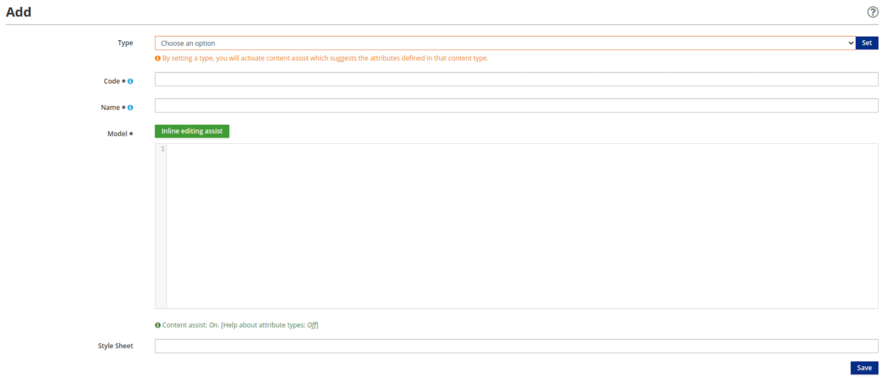

# Content Templates

Content Templates define how information is displayed when a Content is published. They provide the styling and layout for Content Types and offer different representations of the same content.

## Create a Content Template

Content Templates are managed via the Web CMS, through a user interface provided by the [Entando App Builder](../../docs/getting-started/concepts-overview.md#entando-app-builder). Follow the steps below to create and configure a Content Template.

**1. From the left menu of the App Builder, go to `Content` → `Templates`.**

**2. Click the `Add` button in the upper right corner.**  

**3. Define the characteristics of the Content Template:**

- `Type`: Choose a Content Type from the drop-down list. Click the `Set` button to input your selection and enable Attribute suggestions in subsequent fields.

- `Code`: Enter a sequence of up to 10 numbers to uniquely identify the Content Template. This field is mandatory.

- `Name`: Enter a string of 50 characters or less for the name or description of the Content Template. Your entry may consist of uppercase and lowercase letters, numbers and/or special characters.

- `Model`: Enter HTML to model the Content Template based on Velocity language.

- `Style Sheet`: (Optional) Enter the CSS to be applied to the HTML `Model`.

**4. Click the `Save` button.**

This adds the Content Template to the Content Type.

