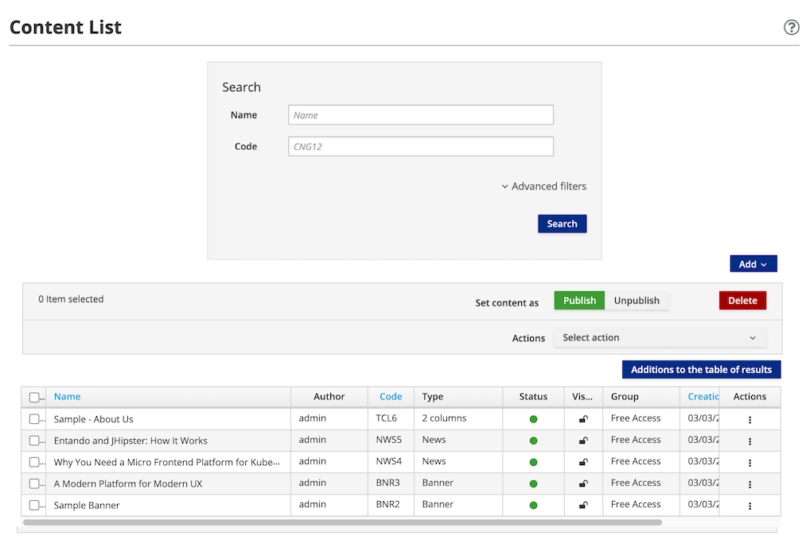

# Content Creation

This tutorial describes how to create, edit and publish content in an application with the Entando Web Content Management System from within the [App Builder](../../docs/compose/app-builder.md).

## Create Content

1. Log into your App Builder.

2. From the left sidebar, go to `Content` → `Management`. All existing 
    content is displayed in a table.

3. To create new `Content`, click the `Add` button on the right side of page. Select the `Type` desired from the drop-down list. New types can be added to the list in the [Content Type](./content-types-tutorial.md) section.

4. You are asked to provide the following information.
    * `Info` 

         * `Content Type`: This is predefined. 

         * `Description`: Enter the name or description. This field is required.

    *   `Groups`

         * `Owner Group`: Choose an available user group to manage the content from the drop-down list. Click the `+` symbol to select. This field is required and can be amended in the App Builder's `User` section under `Groups`.

         * `View Only Groups`: Add groups to provide viewing access to content. 

    *   `Categories`: Click `+` under `Join` to include the `Content` in the appropriate category for searching and sorting.  This field is not mandatory.

    *  `Content Attributes`: Enter the required `Date` and `Title` fields under the `Attributes` section. You can enter the remaining optional fields as needed.
    * `Content Info - History`: This displays the iterations for the saved item. You can view the details or revert to a previous version. 

## Save and Approve Content 
1. For new or edited content, determine which `Status` it belongs to:  

 * `Draft`: The `Content` is in the development stage and not ready for approval or publication. The `Save` or `Save and Continue` buttons establish `Draft` status for the content.

 * `Ready`: The `Content` is ready for review, but has not been approved or published.  Items with this status can be saved and approved later or published immediately.

2. Saving options:

-   `Save`: The content is saved in a `Draft` version.

-   `Save and Continue`: The content is saved in a `Draft` version and the editable form is displayed.

-   `Save and Approve`: The content is saved, approved, and ready for use in an application.

## Find Content

Using the `Advanced Filters` feature, you can search for Content by name, type, category, group, or status. 

In the resulting table, content is listed with these parameters: `Name`, `Author`
`Code`, `Created by`, `Last Edited`, `Type`, `Status`, `Visibility`, `Group`, `Creation` Date, `Last Modified`, and executable `Actions`. Any field can be deleted from view by unchecking them in the `Additions to the Table of Results` drop-down menu.

## Content Actions

For all items in the `Content` table, the `Actions` drop-down menu provides these executable options:

* `Copy/Paste`: Replicate the content

* `Draft Version`: Edit the unpublished draft version

*  `Published Version`: Edit or revert to a previous published version of the content

*  `Edit`: Update the data fields in the Content definition

## Publish, Unpublish, or Delete Content

To `Publish`, `Unpublish`, or `Delete` content, use the buttons above the table for checked items. This takes you to a confirmation page where a summary displays the usage of the item in your application. 

