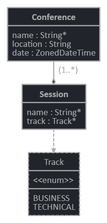

# Update the Project Data Model

## Overview

This tutorial explains how to use the [Entando Component Generator](../../../docs/create/component-gen-overview.md) powered by [JHipster](https://www.jhipster.tech/) to quickly update the data model for your Entando project.

## Prerequisites
The steps below assume you're working out of the top-level directory of an existing project. To satisfy this prerequisite, you can [create a project](./generate-microservices-and-micro-frontends.md) and navigate to the root folder.

## Tutorial
1. Use JHipster to extract the current application description. The resulting JHIpster Domain Language (JDL) file contains your project's application configuration and the entity definitions forming the basis of your design work.
```
ent jhipster export-jdl export.jdl
```
2. For simplicity, create a new file comprising only the elements that describe entities. If you followed the [project generation tutorial](./generate-microservices-and-micro-frontends.md), that could be as rudimentary as
```
entity Conference {
  name String
}
```
3. You can enhance this definition by adding fields, entities, table mappings, field validation, etc. This is easily accomplished with the [online JDL-Studio or corresponding JHipster IDE plugins/extensions](https://www.jhipster.tech/jdl/). 

4. Create a new file containing your enhanced data model, e.g. `conference.jdl.`
```
entity Conference {
  name String required
  location String
  date ZonedDateTime
}

entity Session {
  name String required
  track Track required
}

enum Track {
  BUSINESS, TECHNICAL
}

relationship OneToMany {
   Conference to Session
}
```
The above adds two fields to the Conference entity, introduces the Session entity plus an enum, and creates a mapping between the two entities. Below is the updated data model in JDL-Studio:



4. Import the JDL file into your application. The options selected during project generation determine if you are prompted with the option to generate MFEs.
```
ent jhipster import-jdl conference.jdl
```
If the original project structure has been retained, this step will update your data model, add entries to Liquibase to upgrade database schema during deployment, add service methods to your microservice, add fields to your MFEs, etc.

5. You can now build your updated project and [run it locally](./run-local.md) or [deploy it to Entando](../pb/publish-project-bundle.md). To execute a comprehensive local test, use the following commands to build the project
```
ent prj build
ent prj xk start
ent prj be-test-run
ent prj fe-test-run
```
then start Keycloak, the microservice, and one of the MFEs.

Steps 3-5 can be repeated as many times as needed throughout the life of your project.


