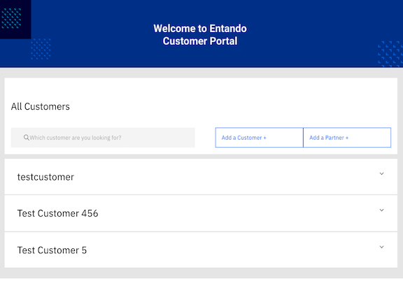
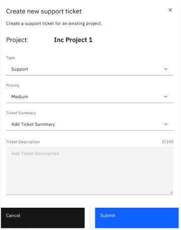

# Entando Customer Portal 
## Overview
The Entando Customer Portal enables an organization to quickly provide a modern, self-service customer-facing application for management of subscriptions. It includes a lightweight integration to JIRA Service Management for access to service tickets and a Role Based Access Control (RBAC) design for granting users varying levels of access.

Key Features:

* Customizable service ticket and tracking system with Jira Service Management
* Role-based access control (RBAC) with Entando Identity Management System
* Integrated user, customer, project, and subscription management 

This tutorial covers: 
1. [Installation](#installation)
2. [Configuration](#configuration)
4. [Managing the Customer Portal](#managing-the-customer-portal)
5. [Using the Customer Portal](#using-the-customer-portal)
6. [Application Details](#application-details)
7. [Resources](#resources)

## Installation
### Prerequisites
* A working instance of Entando running on Kubernetes. See [Getting Started](../../docs/getting-started/) for more information or [install Entando on any Kubernetes provider](../#operations). 
* Use the Entando CLI command `ent check-env develop` to verify all dependencies
* Docker installed and running

### Automatic Install with App Builder
Install the Customer Portal in a few simple steps by integrating the Entando Hub into your App Builder. In the Hub, you can update or roll back versions of a bundle at any time.
1. From your App Builder, go to the Repository from the left navigation bar. Enter Entando Hub in the Registry field at the top of the page. You will now have access to the Hub.

2. `Install` the two bundles for the Customer Portal from the Catalog. Once complete, the Portal is ready for use. 

To go directly to your Portal, navigate to `Pages Management`, use the `Actions` for the Customer Portal and select `View Published Page`.


### Manual Install 
1. To install the Customer Portal, run the following commands in the listed order. Edit the `-n entando` option for each command to match your namespace or project.

``` bash
ent bundler from-git -r https://github.com/nshaw/customerportal-wip-bundle.git -d | ent kubectl apply -n entando -f - 
```

``` bash
ent bundler from-git -r https://github.com/nshaw/customerportal-content-bundle.git -d | ent kubectl apply -n entando -f - 
```
2. Log into your App Builder 

3. Select Repository from the left menu. Two Customer Portal bundles will be visible in the repository. `Install` both bundles, in any version desired. 

4. To navigate to your Portal: \
from the left menu →  `Page` → `Mangement` \
find `Customer Portal` under `Page Tree` list \
from the `Actions` pull-down menu →  `View Published Page`

## Configuration
### Administrators
In order to configure the Customer Portal and its users, the administrator will need Jira Service Management and Entando Identity Management System credentials. The administrator can create and configure users and groups, assign roles and projects, and track service tickets.  They can also customize the ticketing system. 

### JIRA Service Management 

The administrator begins at Jira Service Management to create users, projects, define the organization, and configure the service ticket system.

Go to Customers to add organizations and projects. Once added, click on the name of the organization to get the ID, needed later, from the URL. \
 e.g. example.com/jira/servicedesk/projects/ECS/organization/3 → the organization ID is “3”

### Entando Identity Management System 
Logging into the Entando Identity Management System, you will see the landing page shown below. Like the App Builder, the left navigation bar is your guide for managing users, groups, and most importantly, roles. Using the RBAC model, define what access users have by the roles and groups they are assigned. Some important guidelines are noted below. 


* **Define the Realm Setting**. \
The `Realm` is a set of users, credentials, roles, and groups. A user belongs to and logs into a `Realm`. 

* **Create Roles**\
You can use the default roles by clicking on `Client Roles` and choosing `entandodemo-customerportal-server`. Access for each role is defined as follows:
    * `cp-customer` -  assigned directly to specific projects for a single customer
    * `cp-partner` - assigned directly to specific projects for multiple customers
    * `cp-support` -  read only view of all customer projects
    * `cp-admin` - admin access for the Customer Portal

* **Create New Users**: \
Each new user must have a Jira Service Management account before they can be added to the Entando ID Management System for access to the Customer Portal.
     1. From the navigation bar, go to Users. Click `Add User` at right.
     2. Complete the form as needed but note the requirements for the following fields:\
       `Username`: a unique name\
       `Email`: must use the same address used in Jira\
       `User Enabled` → On\
       `Email Verified` → Off\
     `Save`

     3. Send an email to the user to activate their account and set a new password: \
     Go to `Credentials` header. \
     Under `Credential Reset`, in the `Reset Actions` → `Update Password`. For external users, the recommendation is to extend the `Expires In` setting to a minimum of 2 days. \
     Click `Send Email`. \

     4. Go to Role Mapping. \
     Select the appropriate `Realm Roles` from the `Available Roles` and click `Add Selected` to assign. \
     You can also choose `entandodemo-customerportal-server` from the `Client Roles` pull-down menu. This will display the default roles to add. \
     Check the `Effective Roles` column on right to ensure the correct roles have been assigned.


  5. Under `Groups`, assign roles to groups as needed. Roles are additive.

## Managing the Customer Portal

As administrator for the Customer Portal, you can create and manage: users, customers, projects, and subscriptions. You can also assign projects to users who have activated their account on Jira and have been assigned roles in the Entando Identity Management System. 

The administrator needs a Jira account and the correct role assignment in the Entando ID Management System as well.



* **Create a Customer or Partner**\
Creating a `Customer` or `Partner` is a similar process. Below are the steps for adding a `Customer`. Please follow the same procedure for adding a `Partner`.
1. Click `Add a Customer`
2. Fill in the details. Note the following:
     * The `Customer Number` must be unique 
     * The `Notes` field is visible only to Support and Admin users 

    

* **Create & Assign Projects**
1. From the landing page, click on any customer to see the associated Project list.
2. To create a new Project, click `Add a Project`
    * Enter the `Project` information
    * Provide the Organization ID from Jira. Each project must have a unique Organization ID.
    * Click `Save`
3. To assign Projects
	* Use the drop-down menu under `Action` on the right → `Manage Users`
    * Select the user for the Project and click `Submit` 
    
* **Manage Partners and Subscriptions** \
Use the drop-down menu under `Action` to manage Partners, and request and manage subscriptions. 

## Using the Customer Portal

All Customer Portal users need Jira Service Management credentials and role access provided by your organization administrator. You can request and track subscriptions as well as create and track service tickets.

Once you login to the Customer Portal, you will see a list of customers. Click on any customer to see their details and track their projects.

1. To create a `Service Ticket` for a project, use the `Action` pull-down menu  → `Open Ticket`



2. To request a Subscription or track Tickets, use the `Action` pull-down menu and select the corresponding option.

## Application Details
The Entando Customer Portal demonstrates a number of major features in the Entando platform including:

* Keycloak integration for role based access controls
* Integration with JIRA Service Management for a customizable ticketing system 
* Micro frontends using React and Angular and co-existing on the same dashboard page
* Micro front communication techniques
* Microservices run via Spring Boot
* Entando Content Management

## Resources
* Go to [Jira Service Management](https://www.atlassian.com/software/jira/service-management) for more information.
 

* Source Code\
The source for the Entando Customer Portal can be found with our other open source examples and tutorials on GitHub at: [https://github.com/entando-samples/customer-portal/](https://github.com/entando-samples/customer-portal/)

