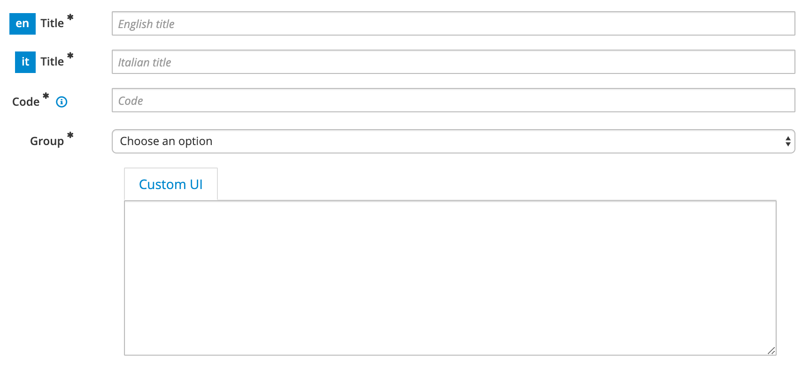

# Create a React Micro Frontend

::: warning Tested Versions
node v13.8.0
- Note: We suggest using [nvm](https://github.com/nvm-sh/nvm) to handle node installations.
:::

## Create React App

We'll use [Create React App](https://create-react-app.dev/) to create a simple app in seconds.

``` bash
npx create-react-app my-widget --use-npm
```

This is the expected output:

    my-widget
    ├── README.md
    ├── node_modules
    ├── package.json
    ├── .gitignore
    ├── public
    │   ├── favicon.ico
    │   ├── index.html
    │   ├── logo192.png
    │   ├── logo512.png
    │   ├── manifest.json
    │   └── robots.txt
    └── src
        ├── App.css
        ├── App.js
        ├── App.test.js
        ├── index.css
        ├── index.js
        ├── logo.svg
        ├── serviceWorker.js
        └── setupTests.js

Start the app.

``` bash
cd my-widget
npm start
```

## Custom HTML Element

Add a new file `src/WidgetElement.js` with the custom element that will wrap the entire React app.

``` js
import React from 'react';
import ReactDOM from 'react-dom';
import App from './App';

class WidgetElement extends HTMLElement {
    connectedCallback() {
    this.mountPoint = document.createElement('div');
    this.appendChild(this.mountPoint);
    ReactDOM.render(<App />, this.mountPoint);
    }
}

customElements.define('my-widget', WidgetElement);

export default WidgetElement;
```

- `connectedCallback` is a lifecycle hook method of Custom Elements, which is part of the Web Components specification.
- The React `root` is programatically generated in the `connectedCallback` method of `WidgetElement`.


## Import Custom Element

::: warning Note
[Custom Elements](https://stackoverflow.com/questions/22545621/do-custom-elements-require-a-dash-in-their-name):
- Must contain a hyphen `-` in the name.
- Cannot be a single word.
- Should follow `kebab-case` for naming convention.
:::

Open `src/index.js`.

``` js
import React from 'react';
import ReactDOM from 'react-dom';
import './index.css';
import App from './App';
import * as serviceWorker from './serviceWorker';

ReactDOM.render(<App />, document.getElementById('root'));

// If you want your app to work offline and load faster, you can change
// unregister() to register() below. Note this comes with some pitfalls.
// Learn more about service workers: https://bit.ly/CRA-PWA
serviceWorker.unregister();
```

Replace the entire file with these two lines.

``` js
import './index.css';
import './WidgetElement';
```

- We won’t need a service worker so we can delete `serviceWorker.js`.

## Add to index.html

1. Open `public/index.html`.

2. Replace `<div id="root"></div>` with the custom element `<my-widget />`.

``` html
  <body>
    <noscript>You need to enable JavaScript to run this app.</noscript>
    <my-widget />
    ...
  </body>
```

::: tip Congratulations!
The page should auto reload, and you’re now running a barebones micro frontend.
:::

## npm build

In order to avoid path issues, we should set up a one line `.env` file
in the CRA project root:

    PUBLIC_URL=http://localhost:8080/entando/resources/static/my-widget

Where `` is the path of the Entando 6 instance containing the widget.

Ready to build now! From the react project root, type

``` bash
npm run build
```

A `build` dir will be generated. Now rename:

- `static/js/runtime~main...js` to `static/js/runtime.js` (bootstrapping logic)
- `static/js/...chunk.js` to `static/js/vendor.js` (third-party libraries)
- `static/js/main...chunk.js` to `static/js/main.js` (app)
- `static/css/main...chunk.js` to `static/css/main.css` (stylesheet)

::: warning Note
You could keep the original names in order to avoid potential caching issues, but then you will have to update the *Custom UI* field in the App Builder widget screen every time a new version of the widget is deployed. Entando bundles can help with this and are covered in the Entando Component Repository section.
:::

## Add Widget in Entando

For the purposes of this tutorial we are going to load the widget to the
App builder manually. In a live system you would include this in an
Entando app, load via API, or via a Component Repository bundle.

Open the Entando App Builder

1.  Go to Configuration → File Browser

2.  Click public

3.  Click Create Folder

4.  Enter `my-widget`

5.  Click save

6.  Click `my-widget` folder

7.  Recreate the same folder structure (my-widget/static/js,
    my-widget/static/css)

8.  Upload files from js and css folders in the corresponding folders in
    file browser

::: warning Note
You can also embed the widget directly in a local copy of an Entando app. Copy it into the Entando 6 instance under
`src\main\webapp\resources\my-widget`.
:::

Now create the widget in the App Builder

Go to UX Patterns → Widgets and click on the *New* button.

You’ll see a screen like this one



Fill the form, e.g.:

-   *my\_widget* as widget code (dashes are not allowed in a widget
    code)
-   *My Widget* as title for all the languages
-   *Free access* as group
-   the following code as *Custom UI*

``` ftl
<#assign wp=JspTaglibs[ "/aps-core"]>
<link rel="stylesheet" type="text/css" href="<@wp.resourceURL />my-widget/static/css/main.css">
<script async src="<@wp.resourceURL />my-widget/static/js/runtime.js"></script>
<script async src="<@wp.resourceURL />my-widget/static/js/vendor.js"></script>
<script async src="<@wp.resourceURL />my-widget/static/js/main.js"></script>
<my-widget />
```

Update the paths to match what you loaded to the app builder in the
steps above. And save the widget.

::: warning Note
`<#assign wp=JspTaglibs[ "/aps-core"]>` is needed for your widget code to have access to `@wp` object which provides access to environment variables.
:::

Then, configure a page (let’s assume it’s called *mypage*) and drag the widget *mywidget* in the page model. Publish, load the page (its url should be ``) and *voilà*, here’s our react app embedded as a widget. Done!
