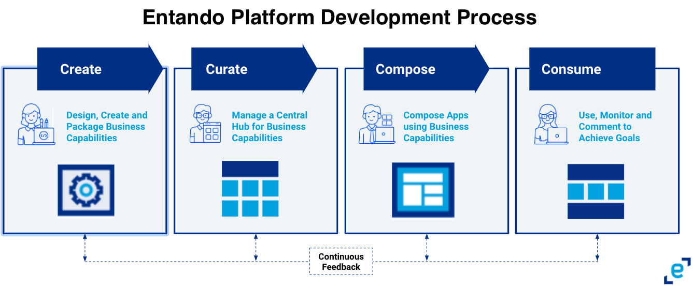

# Development Process on Entando
 
With the Entando Platform, the development of an application is organized into four distinct stages: Create, Curate, Compose, and Consume. In the simplest terms, you **Create** functional building blocks, **Curate** them into a catalog, **Compose** the blocks onto a page or a website, which is then **Consumed** in an application.

Entando provides a distributed and composable environment in which components can be independently built, scaled and iterated. This process enables parallel teams to accelerate development and innovation on a cloud- and Kubernetes-native stack.

## Create Components 
The first step in building a modern application on Entando is to design and create each independent component or functional block. Developers can use the [Entando Component Generator](../create/component-gen-overview.md) and [Blueprint](../create/blueprint-features.md) to automate the building and packaging of project files, with the flexibility to customize. The modular design of apps built on Entando means new business capabilities can be integrated into your application without reworking existing systems. 

| Documentation | Tutorials        |
| :------------ | :--------- |
| [Entando Component Generator](../create/component-gen-overview.md) | [Micro Frontends](../../tutorials/create/mfe/) |
| [Entando Blueprint Feature](../create/blueprint-features.md) | [Microservices](../../tutorials/create/ms/generate-microservices-and-micro-frontends.md) |
| [Component Generation Technologies](../create/component-gen-tech.md) | [Build and Publish Project Bundles](../../tutorials/create/pb/publish-project-bundle.md) |

    
## Curate and Share Components 
On the Entando Platform, Curate and Share means development teams can bundle and share components within a central catalog. Multiple teams or groups can collaborate on single components or a whole packaged business capability (PBC) across organizations and applications. They can test and assess components for readiness, manage and publish versions and share metadata for continuous upgrades. 

| Documentation | Tutorials        |
| :------------ | :-------- |
| [Bundle and Component Descriptors](../curate/ecr-bundle-details.md) | [Install Bundles from a Private Git Repository](../../tutorials/curate/ecr-private-git-repo.md) |
| [Filtering Bundles](../curate/ecr-bundle-filters.md) | [Install Bundle Plugins from a Private Image Repo](../../tutorials/curate/ecr-private-images.md) |
| [Customize Bundle Info in App Builder](../curate/ecr-bundle-presentation-config.md) |   |
| [Bundle Version and Updates FAQ](../curate/ecr-bundle-versions-faq.md) |  |
| [Bundle Uninstall](../curate/ecr-uninstall-flow.md) |  |

## Compose an Application 
The Compose stage on Entando is centered around the [Entando App Builder](../compose/app-builder.md), a low-code composition user interface. In the App Builder, application owners can assemble new components or upgrade existing ones with templates, widgets and fully functional PBCs. The [Entando Component Manager](../compose/ecm-overview.md) and [Entando Component Repository](../compose/ecr-overview.md) are integrated into the App Builder, making the composing process flexible and agile by managing all your components there.

| Documentation | Tutorials        |
| :------------ | :-------- |
| [Welcome Wizard](../compose/welcome-wizard.md) | [Page Management](../../tutorials/compose/page-management.md) |
| [Entando Component Repository](../compose/ecr-overview.md) | [Widgets and Fragments](../../tutorials/compose/widgets-fragments.md) |
| [Entando App Builder](../compose/app-builder.md) | [Content Creation](../../tutorials/compose/content-tutorial.md) |
| [Entando Component Manager](../compose/ecm-overview.md) | [Content Templates](../../tutorials/compose/content-templates-tutorial.md)  |
|  | [Digital Assets](../../tutorials/compose/digital-assets-tutorial.md) |

## Consume Applications 
In the development lifecycle of an application, Consume is the execution stage where end users interact with the app to complete certain tasks. On Entando, the modular design of the components and services means each can be scaled individually or as a whole, according to those interactions. Likewise, content can be added or changed, engine rules adapted and upgrades made seamlessly. As a result, the development cycle is a continuous process with minimal disruptions and faster time to market.

| Documentation | Tutorials        |
| :------------ | :-------- |
| [Accessibility](../consume/accessibility.md) | [External Identity Management System](../../tutorials/devops/external-id-management.md) |
| [Entando Operator](../consume/operator-intro.md) | [Add REST API](../../tutorials/devops/add-rest-api.md) |
| [Entando APIs](../consume/entando-apis.md) | [Invoke Entando core APIs](../../tutorials/devops/build-core-image.md) |
| [Custom Resources](../consume/custom-resources.md) | [Change Default Datasource](../../tutorials/devops/change-default-datasource.md) |
| [Entando Identity Management System](../consume/identity-management.md) |  |

