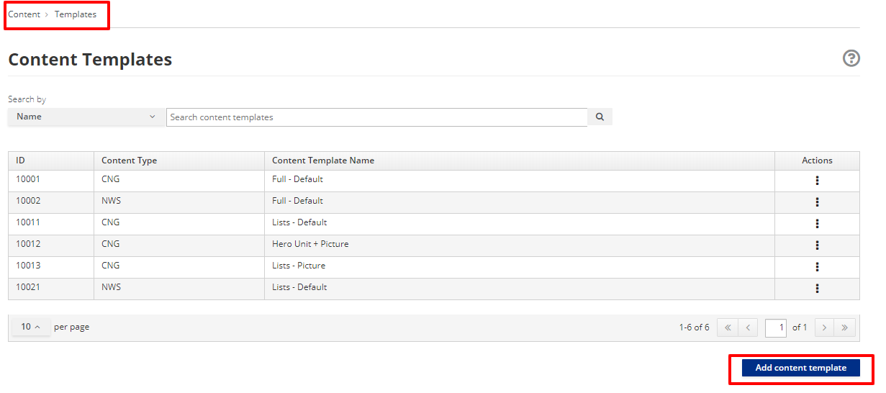

--- 
redirectFrom: /v6.3.2/tutorials/cms/content-templates-tutorial.html
---

# Content Templates

Content Templates define how the information in a Content item is displayed to an end user once published. Content Templates provide styling and layout for Contents Type and can be used to show the same content in different ways. Content Templates can be managed within the App Builder.

## Create a Content Template

Creating a Content Template is fairly simple. From the App Builder
application

-   Go to `Content → Templates`

-   Click on the **Add content template** to create a new Content
    Template.

-   Access the **Add Content Template** page, where you can

    -   Edit the `Code`. It is the unique identifier of the content template.
        You can insert up to 10 numbers. It’s mandatory.

    -   Edit the `Name`. It is the name or description of the content
        template.

    -   Choose the `Content Type` in the dropdown list.

    -   Edit the `HTML Model` based on Velocity language

    -   (Optional) Define the CSS `Style Sheet` to be applied to the `HTML Model`

    -   Press the Save button

