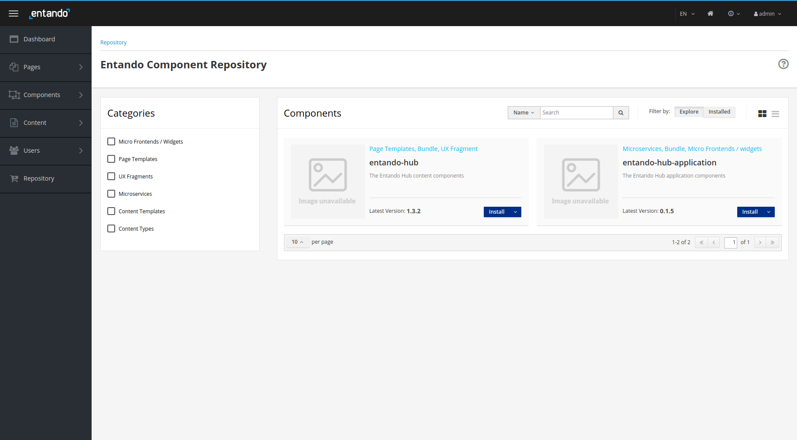
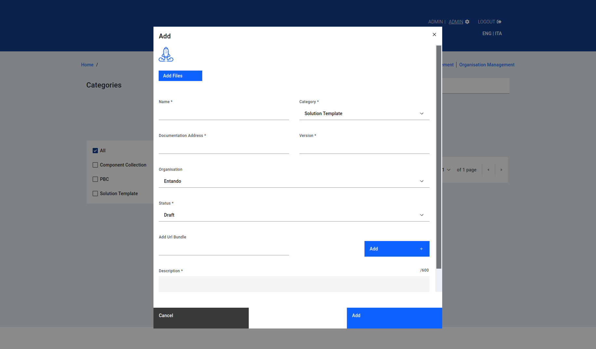

# Entando Hub
## Overview

The Entando Hub enables a team to share components across Entando Applications. It can be installed in Entando 6.3.2 or higher and includes API-level integration with the Entando 7.0 App Builder.

The Hub allows users to:

- Centralize components and business capabilities for use across teams, groups, or clients.
- Publish, manage and communicate component features, versions and metadata.
- Perform business-level assessment of component readiness. 

This tutorial covers:

1. [Installation](#installation)
2. [Configuration](#configuration)
3. [Using the Hub](#using-the-hub)
4. [Application Details](#application-details)
5. [Resources](#resources)
## Installation

The Hub is installed using the Entando Component Repository (ECR) and two Entando Bundles.  The first bundle contains the Hub micro frontends and microservices, and the second sets up the initial content and pages for the Hub user experience.

### Prerequisites

- An Entando Application on any Kubernetes provider. Follow the [tutorials](../#operations) appropriate to your environment to install the Entando platform.
- The [ent command line tool](../../docs/reference/entando-cli.md#overview), installed and connected to your Kubernetes instance.

### Installation Steps

1. Apply the Custom Resource Definitions for the Hub component bundles. You'll need to adjust the `-n entando` option in each command to match your namespace or project.

```
ent bundler from-git -r https://github.com/entando-samples/entando-hub-application-bundle.git -d | ent kubectl apply -n entando -f -
```
```
ent bundler from-git -r https://github.com/entando-samples/entando-hub-content-bundle.git -d | ent kubectl apply -n entando -f -
```

2. Log into your App Builder instance.

3. Select `Repository` from the menu on the left. Your bundles will be visible in the repository as shown in the screenshot below.



4. Select `Install` for each bundle, where order of installation is important. The `entando-hub-application-bundle` must be installed first because it provides the `entando-hub-content-bundle` with MFEs. It may take several minutes to download the Docker images for the microservices and install related assets.

:::warning 
(Entando 6.3.2) A cache issue impacting the first deployment of the `entando-hub-content-bundle` can prevent all widgets or MFEs from appearing on some pages, particularly the Dashboard page. 

To clear the cache, select `Administration` from the bottom of the left menu, then `Reload configuration`.

Alternatively, restarting the quickstart-server pod (which contains the Entando App Engine) will also clear the cache, and can be achieved with `ent k delete pod/<YOUR QUICKSTART-SERVER POD>`, e.g. `ent k delete pod/quickstart-server-deployment-5d785b997c-r4sc8`. It will take several minutes for the pod to redeploy after deletion. 
:::

5.  Set up permissions to configure the service:
   - [Login to your Keycloak instance](../../docs/consume/identity-management.md#logging-into-your-keycloak-instance) as an admin.
   - Give at least one user the ability to manage the Hub by granting the `eh-admin` role. Assign the `eh-admin` role for the `pn-cee95efc-77ff566e-entandopsdh-entando-hub-catalog-ms-server` client. Go to [Assign client roles](../../docs/consume/identity-management.md#authorization) for more details.
   - Give the generated plugin client permission to manage users. 
       1. From the left sidebar, go to `Clients`, and select client ID `pn-cee95efc-77ff566e-entandopsdh-entando-hub-catalog-ms-server`. 
       2. Click the `Service Account` tab at the top and select `realm-management` from the `Client Roles` field. 
       3. Choose `realm-admin` from `Available Roles`.  Click `Add selected`. It should appear as an  `Assigned Role`.

6. Access the Hub from the App Builder by navigating to `Pages → Management`, finding `Entando Hub` in the page tree, and clicking `View Published Page` from its actions.

## Configuration

::: tip   
(New with Entando 7.0.0) Any Hub instance can be accessed from the Entando App Builder of another Entando Application. Configure the App Builder to access the desired Hub instance via the endpoint `BASEURL/entando-hub-api/appbuilder/api`, where the BASEURL is the URL for the Entando Application.
:::

## Using the Hub

### Concepts

The key entities in the Entando Hub are:

- `Bundle Group`: A Bundle Group is a group of one or more Entando Bundles. 
- `Bundle Group Version`: A Bundle Group can have one or more versions, each with a particular status.
- `Bundle`: A Bundle is the deployment unit within an Entando Application. A Bundle can contain one or multiple components such as micro frontends, microservices, or any of the [component types](../../docs/curate/ecr-bundle-details.md#overview) available in Entando. 
- `Category`: Each Bundle Group belongs to a specific category. The initial possible categories are Solution Template, Packaged Business Capability (PBC), or Component Collection. An admin of an Entando Hub can refine the available categories as desired.
- `Organization`: Bundle Groups belong to a single organization. Authors and managers can only update Bundle Groups for their own organization.  
- `User`: User identity is managed within Keycloak, where users are granted roles within the Hub. Users must be assigned to a specific organization.

Notes:
- A private repository can be used for a Bundle, but this requires [an additional Kubernetes secret](../curate/ecr-private-git-repo.md#overview) before deployment via the App Builder.

### Roles

Three roles are used to provide access to the Hub features:

- `eh-author`: An author can create and edit Bundle Groups for their organization and submit them for publication.
- `eh-manager`: A manager has the permissions of an author, but can also approve a publication request for their organization.
- `eh-admin`: An admin has full access to create, update, and delete Bundle Groups for the entire Hub instance. An admin can also create categories and organizations, and assign users to an organization.
- `guest`: Any user without one of the preceding roles is considered a guest in the Entando Hub and is given a read-only view of the public catalog. This is also true for unauthenticated users.

### Bundle Group Version Status

The possible statuses for the versions of a Bundle Group are:

- `Draft`: This is the default status for the first version of a Bundle Group. 
- `Publication Request`: An eh-author sets a version to this status to request an eh-manager or eh-admin to review the version and mark it for publication. An eh-manager or eh-admin may edit versions with this status.
- `Published`: Versions with this status are visible in the home page list of available Bundle Groups and also available in the App Builder-facing API. An eh-manager or eh-admin may edit Published versions.
- `Archived`: Previously Published versions are assigned this status. No edits can be made on an Archived version.
- `Deletion Request`: An eh-manager or eh-admin can delete versions once this status has been set.

Notes:
- An eh-author can change any field except Organization while a version is in Draft.
- There is no automated notification process when a Publication Request is made for a Bundle Group version.

### Bundle Group Creation
Clicking the `Add +` button at the top of the page displays the form for creating a new Bundle Group:


### Bundle Group Versions
The list of Bundle Group Versions can be seen by clicking `View Versions` on any entry in the catalog:


Notes:
- Once the first version of a group is published, the organization, name, and category can no longer be changed.
- A new version of a Bundle Group can be created (via the `New Version` option) after the first version has been published. 
- There can be at most two active versions: one Draft or Publication Requested version and one Published version. 
- When a new version is published, the previous version is set to Archived. 
- Archived versions are only visible in the versions view and are not shown elsewhere in the user interface.


## Application Details

The Hub includes the following key components:

### Micro Frontends / Widgets
- `Entando Hub App`: This is the main micro frontend which contains the management UI for the Hub entities noted above.
- `Entando Hub Login`: This is an optional login component which can be used in a page’s top navigation.

### Microservices
A single Spring Boot microservice provides two REST endpoints:
- The first is a backend-for-a-frontend (BFF) service for the Hub UI and contains the various entity APIs.
- The second provides methods that support the Entando App Builder integration (7.0.0+).

### Content
The Hub content bundle (`entando-hub`) includes a custom template and a page preconfigured with the main Hub micro frontends.

### Integration
The Entando App Builder should be configured using the endpoint `BASEURL/entando-hub-api/appbuilder/api`, where the BASEURL is the URL for the Entando Application.

## Resources
### Source Code

Entando open source examples and tutorials are available on GitHub. Reference the Hub sample project for instructions to build the project from source code:

- <https://github.com/entando-samples/entando-hub>