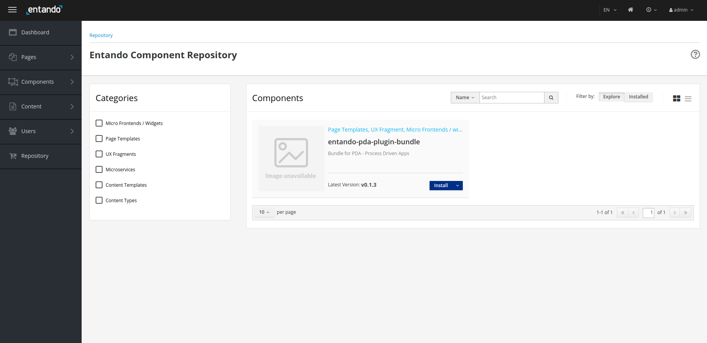
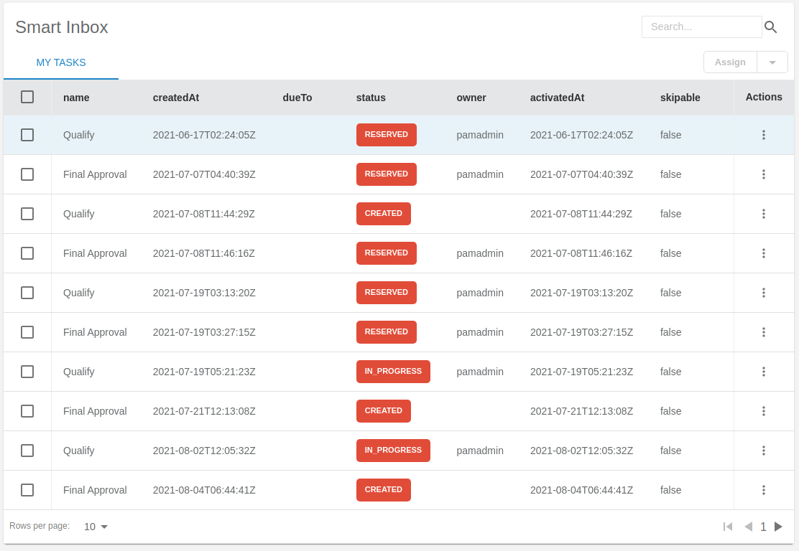
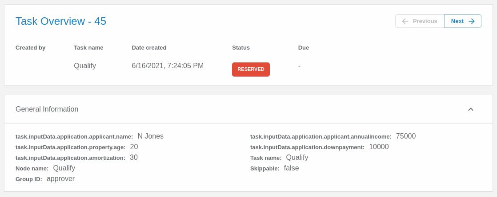
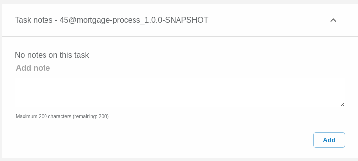
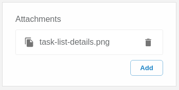
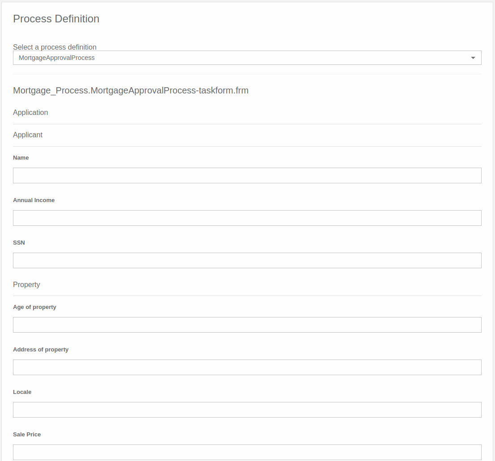
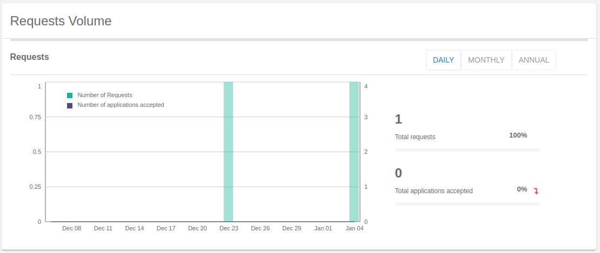

# Entando Process Driven Applications Plugin

## Introduction

The Entando Process Driven Applications (PDA) plugin is engineered to provide a rich and full-featured user experience while facilitating the management and completion of business processes and automation.  This solution template includes: 

- A general purpose UX layer created from micro frontends that can be implemented for any business process or task engine. The UX layer can serve data via the included Entando integration adapter or by implementing a set of interfaces on the server side.
- A Spring Boot microservice backend providing a pluggable interface for the injection of underlying processes or automation toolkits. The interfaces and steps for creating a new PDA backend implementation are described in further detail [here](../solution/pda-technical-guide.md).

This tutorial will guide you through installing the PDA plugin using the Entando Component Repository (ECR) and an Entando Bundle. This exercise demonstrates the scope of process automation enabled by integrating the following: 

- Custom Micro Frontends (MFEs)
- Backend for Frontend (BFF) microservice
- [Red Hat Process Automation Manager](https://www.redhat.com/en/technologies/jboss-middleware/process-automation-manager) (PAM)

Key elements of the template are reviewed in the [Application Details section](#application-details) below.

## Installation

There are numerous assets installed as part of the Entando PDA plugin. Entando Bundles can include more or less components, depending on objectives. It is recommended that organizations develop guidelines for bundle sizing that fit the goals of their applications and teams.

### Prerequisites

- An Entando Application on any Kubernetes provider. Follow one of the [tutorials](../../docs/getting-started/#operations) appropriate to your environment to install the Entando platform.
- The ent command line tool, installed and connected to your Kubernetes instance.
- Red Hat PAM

### Installation Steps

1. Apply the Custom Resource Definition for the PDA plugin component bundle. You'll need to adjust the `-n entando` option in each command to match your namespace or project.
```
ent bundler from-git -r https://github.com/entando-samples/entando-process-driven-plugin-bundle.git -d | ent kubectl apply -n entando -f -
```

2. Log into your App Builder instance.

3. Select `Repository` from the menu on the left. Your bundles will be visible in the repository as shown in the screenshot below.



4. Select `Install` to install the bundle. An installation can take several minutes while the application downloads the Linux images for the microservices and installs the related assets.

5. Setup permissions to configure the service:
   - Log in to Keycloak as an admin and add the PDA roles to your user account. To manage the required Keycloak instance, see [Entando Identity Management -- Keycloak](../../docs/consume/identity-management.md#logging-into-your-keycloak-instance).
      - Go to `Users → admin → Role Mappings` and add the roles for the entando-pda-plugin-server.
   - Log in to the App Builder and configure the PDA Connection.
      - The Page Templates hardcode the name of the datasource. You can choose to change the name there or simply use 'pam-demo' as the connection name.
      - Set the engine to 'pam,' which will work for jBPM or PAM.
      - Provide your connection URL to the KIE Server rest services, e.g http://my.server.net:8080/kie-server/services/rest/server.
      - Username/password should be for a jBPM or PAM service account user, e.g. krisv.
      - The Timeout is in milliseconds, e.g. 60000.
   - (Optional) If you didn't use 'pam-demo' as your data source name, go to `Pages → Management` and configure the data sources for the widgets on the following pages: click `Design` on the page, then `Settings` on any widgets with `Settings` to review and update the config settings.
      - PDA Dashboard
      - PDA Process Definition
      - PDA Smart Inbox
      - PDA Task Details

:::warning 
(Entando 6.3.2) A cache issue impacting the first deployment of the `entando-pda-plugin-bundle` can prevent all widgets or MFEs from appearing on some pages, particularly the Dashboard page. 

To clear the cache, select `Administration` from the bottom of the left menu, then `Reload configuration`.

Alternatively, restarting the quickstart-server pod (which contains the Entando App Engine) will also clear the cache, and can be achieved with `ent k delete pod/<YOUR QUICKSTART-SERVER POD>`, e.g. `ent k delete pod/quickstart-server-deployment-5d785b997c-r4sc8`. It will take several minutes for the pod to redeploy after deletion. 
:::

6. Utilization of the PDA plugin begins with the Smart Inbox, which can be accessed from the App Builder by navigating to `Pages → Management`, finding `PDA Smart Inbox` in the page tree, and clicking `View Published Page` from its actions.
## Application Details
 
The Entando PDA plugin demonstrates several of the major features of the Entando platform, the configuration and capabilities of which are summarized below. For a discussion of these components in the context of deployment, see [PDA Deployment Architecture](./pda-architecture.md).
### Micro Frontends (MFEs)

This section provides a brief description of each MFE available to the PDA plugin. Details specific to the PAM implementation of an MFE are included where appropriate. MFE behavior and datasources must be defined if the integration layer is extended to other engines or custom implementations.
#### Task List
 
The Task List MFE provides the user with a list of visible tasks that are
either assigned to or could be claimed by that user. In the default implementation, the visible tasks are limited to a
single process instance. At configuration time, the application designer
is given the option to select a set of columns that will be visible in
the task list for that page.
 


The default PAM implementation exposes the top level task fields in the task list for selection. It is possible to fetch task and process variables from the task list for rendering, but this is disabled by default to optimize performance.
 
#### Task Details
 
The Task Details MFE renders detailed information about a task in a read only grid. It is intended to give the end user the information necessary to process the task. See the Styling section below to customize the layout.


 
The PAM implementation renders task variables in the task details widget.
 
#### Task Comments
 
The Task Comments MFE enables the user to view and add the notes attached
to a task.
 


The PAM implementation reads and publishes notes to the comments endpoint.
 
#### Task Form
 
The Task Form can be accessed by clicking on the Task Overview link found in the Task Details MFE. Its implementation renders a form specific to a task and enables
the user to complete that form. It is a
wrapper around a JSON schema that describes the layout, style and
content of the form. The backend implementation provides the mapping
to the schema and default UX layout needed to render the form. See the
[technical documentation](../solution/pda-technical-guide.md) for more on the JSON schema
implementation.
 
The PAM implementation of forms depends on the presence of a form definition for the PAM task. The Entando PAM engine implementation transforms the PAM format to the JSON schema to render the form. It also transforms the API format back to the PAM format. There are some limitations on form customization due to the format required to return data to PAM. See the Task Forms section in the technical documentation for more information.
 
#### Attachments
 
The Attachments MFE enables the user to view and add documents attached to a task, case or process. After selecting an entry in the Smart Inbox task list, use the App Builder to add the Attachment MFE to that entry's page by navigating to `Pages → Management`; select `Design` from the `PDA Smart Inbox` actions and drag the "PDA - Task Attachments" widget into its placeholder.


 
The PAM implementation posts the documents to the PAM endpoints for storage.
 
#### New Process Form
 
The New Process Form renders a form enabling the end user to instantiate a new business process instance. The same technology is used to generate a New Process Form and the JSON schema definition for a Task Form.


 
The PAM implementation relies on a form definition attached to the process definition. Entando transforms the PAM representation into a JSON schema form that can be rendered to the end user.
 
#### Summary Cards
 
The Summary Card MFEs provide a view into aggregate data for the process
implementation. The rendered information includes a total value, a trend
value, and a timeframe selector. The Summary Card provides the
the option to request rendering information. This request maps to a call in the underlying engine and provides the summarized data.


 
The PAM implementation of the Summary Card widget relies on the PAM custom query functionality. The PAM PDA engine exposes a configuration file where the custom query can be defined. This allows user customization of the data rendered on the summary cards. The application contains a "properties" file where the user can submit a custom query for each of the cards.
 
#### Totals Over Time
 
The Totals Over Time MFE provides a dual axis line/bar graph displaying
trend information about the process environment. Three summary values can be compared over a single time period.


 
The PAM implementation of the Totals Over Time MFE utilizes custom queries to fetch the summary data rendered in the chart. The queries used in the implementation are defined in configuration files in the MFE and can be updated to render implementation specific data.
 
### Process Automation Manager (PAM)
 
The Entando PDA is built on Process Automation Manager, which is a business process automation engine built and maintained by Red Hat.
 
### Backend for Frontend (BFF)
 
A microservice architecture allows teams to iterate quickly and
develop technology to scale rapidly. Backend for Frontend
is an architecture pattern built with microservices. The key
component of this pattern is an application connecting the frontend
of an application with the backend. The BFF Code Pattern helps to build that component according to IBM’s best practices.
 
## Customization and Extension
 
This section describes how the PDA plugin can be customized and extended via:

- Styling
- Implementing a new engine
- Integrating a new task source

For an in-depth discussion of the PDA architecture, refer to the [PDA Technical Guide](./pda-technical-guide.md).
 
### Styling
 
The Entando PDA MFEs are styled via a Material UI theme. That theme can
be downloaded and updated [here](https://github.com/entando/frontend-libraries/tree/master/packages/entando-ui).
 
### Implementing a New Engine or Integrating a New Task Source
 
Implementing a new engine for Process Driven Applications means
creating a new Java project and implementing the interfaces defined in the
`pda-core-engine` project. The new project should therefore include the
`pda-core-engine` as a dependency.
 
To see an implementation in action, consider the `pda-redhatpam-engine` project, which implements the Red Hat PAM engine integration. The resultant JAR file should be available in the classpath for the `entando-process-driven-plugin`, which is the project that
is ultimately executed and exposes the Rest APIs for the frontend
application.
 
One way to achieve this is by publishing the engine
implementation to a Maven repository and adding it as a dependency to
the `entando-process-driven-plugin` project. Below are the descriptions of
the engine class and key interfaces in the `pda-core-engine` project that must be inherited or implemented when creating a new engine
implementation.
 
#### Classes
 
`Engine`: represents a Business Process Management (BPM) engine and exposes the services that are available for that specific implementation. It is intended to be inherited, and the subclass should provide the implementation for each service by calling the superclass constructor with the service implementations as arguments. If any service is not supported, a null value should be passed to the corresponding constructor argument. The engine can provide implementations for service interfaces.
 
#### Interfaces
 
`TaskService`: defines service methods for task retrieval from the BPM engine.
 
`TaskDefinitionService`: defines service methods related to task definition. A task definition specifies which fields or columns are available for all task instances.
 
`TaskCommentService`: defines service methods related to task comment manipulation. It should be implemented if the task comment is supported by the engine.
 
`TaskAttachmentService`: defines service methods to operate on task attachments. It should be implemented if the engine supports file attachment on the task.
 
`TaskFormService`: defines service methods for task form operations, like retrieving the form definition and submitting a form. The Form object can be used to render a form dynamically.
 
`TaskLifecycleService`: defines service methods related to the task lifecycle. The lifecycle operations move the task from one state to another.
 
`TaskLifecycleBulkService`: defines methods for bulk lifecycle operations. Like the TaskLifecycleService, these methods move the task from one state to another, but this interface works with multiple tasks at a time.
 
`ProcessService`: defines service methods for process definitions operations.
 
`ProcessFormService`: defines service methods for process form operations, like retrieving the form definition and submitting a form. The Form object can be used to render a form dynamically.
 
`GroupService`: defines service methods related to groups in the BPM engine.
## Resources
### Source Code

The source code for the Entando PDA plugin can be found on GitHub, along with our other open source examples and tutorials. Reference the component projects for instructions to build from source code:

- <https://github.com/entando/entando-process-driven-plugin>
- <https://github.com/entando/entando-process-driven-plugin/tree/master/widgets>
- <https://github.com/entando/pda-redhatpam-engine>
- <https://github.com/entando/pda-core-engine>
