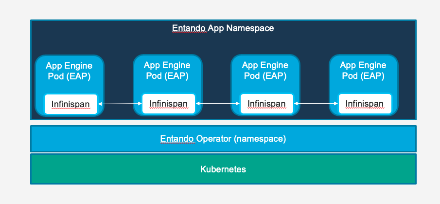

# Caching and Clustering in an Entando Application

## App Engine Clustering and High Availability

The Entando App Engine can be deployed as a clustered set of instances using the clustering and replication ability of Kubernetes. The App Engine is
backed by a shared cache with two chioices of implementation out of the box.

See this tutorial for configuring and testing a clustered instance of the App Engine.

The clustering of microservices built to add functionality to an Entando application is separate from the clustering used by the App Engine. The microservices
have a separate clustering configuration and setup depending on the implementation and choices made in creating those microservices. See the documentation
for your microservices caching implementation for details on configuring and deploying clustered microservices.

## Storage Requirements for Clustered Entando Apps

In order to scale an Entando Application across multiple nodes you must provide a storage class that supports
a `ReadWriteMany` access policy. There are many ways to accomplish this including using dedicated storage providers
like GlusterFS. The cloud Kubernetes providers also provide clustered storage options specific to their implementation like Google Cloud File in GKE or Azure Files in AKS.

__The storage class that supports `ReadWriteMany` must be marked as the default storage class in the deployment__

::: tip
You can also scale an Entando Application without clustered storage using a `ReadWriteOnce (RWO)` policy by ensuring that the
instances are all scheduled to the same node. This can be accomplished using taints on other nodes. Be aware of the pros and cons of scheduling
instances to the same node. This will give you protection if the application instance itself dies or becomes unreachable and will help
you get the most utilization of node resources. However, if the node dies or is shutdown you will have to wait for Kubernetes to reschedule the pods to a different node and your application will be down.
:::

## Caching

### Data Management

At startup time the App Engine will load all database data into the shared cache. When a page is rendered or content is fetched that content will be served from the cache. In the event of a write to the cache the cache and database will both be updated.  

The following objects are cached in the base App Engine implementation

- Pages
- Page templates
- Categories
- Widgets
- Configuration (application level configuration)
- Roles
- Groups
- Languages
- Labels (i18n)
- User profiles
- API Catalog (legacy API metadata separate from swagger)
- Data models and data types (deprecated)

## Infinispan Implementation (Default)

The default implementation, included in the quickstart and base images of the release, of the cache for the App Engine utilizes [Infinispan in Library Mode](https://infinispan.org/docs/stable/titles/embedding/embedding.html#install_library) and it is managed via configuration in the app server hosting the Entando App Engine.

To utilize this implementation you can add replicas of the app engine (entando-de-app) to your deployment. New pods will automatically join the cluster. Ensuring a high availability deployment distributed across nodes depends on the underlying Kubernetes implementation and goals of the deployment. It is up to the implementor of the cluster and the application to ensure that the applications are scheduled to nodes and deployed in a fashion that meets the uptime and performance goals of the Entando Application.

[Read more here](../../tutorials/devops/clustering-caching/caching-and-clustering) for tutorials and step by step instructions on using the Infinispan cache in an Entando App.

## Redis Implementation

An Entando App can also be configured to utilize an external [Redis](https://redis.io/) cache. In a Redis implementation of an Entando App the cache is deployed separately from the App Engine and the App Engine is configured to connect to the deployed instance.

The Redis cache is not deployed by the Entando Operator and must be managed by the implementing teams dev ops or Kubernetes cluster administrators.

[Read more here](../../tutorials/devops/clustering-caching/caching-and-clustering#configuring-and-deploying-with-redis) for tutorials and step by step instructions on using a Redis cache in an Entando App.

## Performance

As you design your Entando App Engine cluster there are a couple of things to keep in mind:

- In a read only implementation, or an implementation with infrequent writes to the cached objects listed above, the network latency between pods on different nodes will not be a major driver of runtime performance. Each pod will have a fully replicated copy of the cache
- In write heavy implementations network latency between nodes can be a factor in performance
  - The overall performance impact of network latency will vary depending on the implementation. The performance depends on the types of objects being written, the size of those objects, and whether the writes invalidate single objects or entire lists of objects in the cache.

In general, it is recommended that performance testing on clustered instances matches the expected runtime traffic pattern of a live application. Every application will have a unique performance profile.

### Cache Management

When a new replica of an Entando App joins a cluster of applications the cache is replicated to that node. If the cache is very large or the network is slow this may add to the total startup time of the new instance. Existing instances will continue to function.
